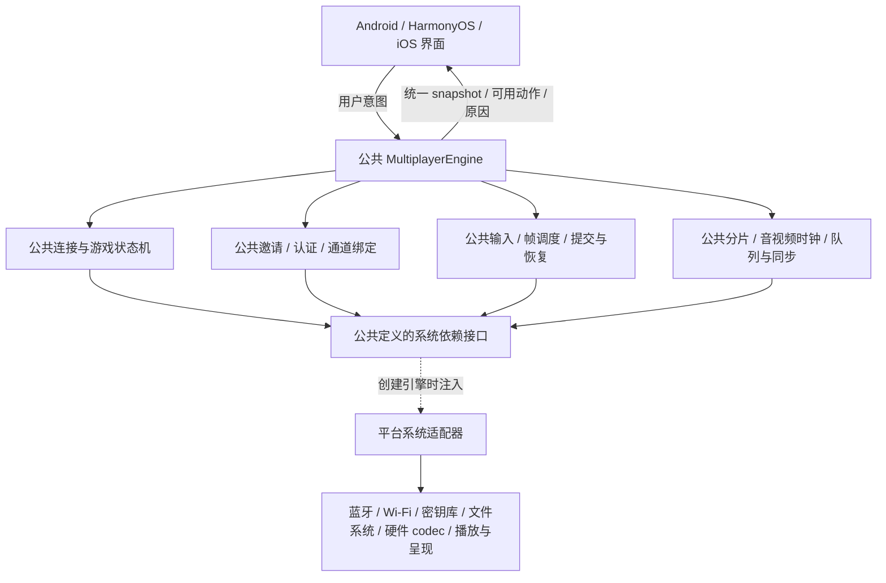
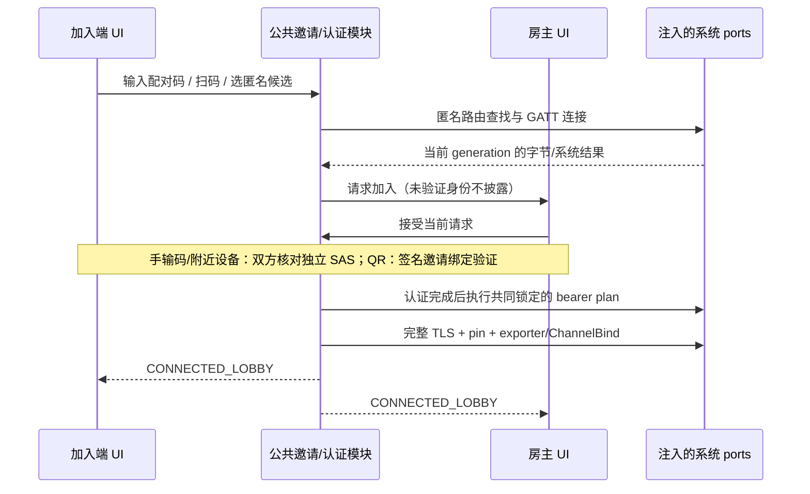
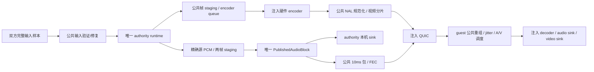

# 多人联机公共引擎与端到端链路修复设计

日期：2026-09-13。状态：**设计草案，待评审；未修改产品代码或协议 schema，未开始实现**。

探查代码基线：`codex/main-test-repair` / `3475d5c`。当时的实现状态与49/49共享CTest结果见[实现探查](../../acceptance/2026-09-13-nearby-backend-audit.md)；本轮只修订设计，没有重新执行这些产品测试。原测试通过不代表生产联机可用。

配套详细设计：

- [公共接口与 UX 映射](2026-09-13-nearby-interface-design.md)：V2 API、DTO、系统 ports 方法、所有权/线程/错误合同，以及获批 N00–N12/G00 的 action/view 对应。
- [测试设计](2026-09-13-nearby-test-design.md)：可复现 harness、接口负例、输入/媒体 trace、逐 phase 崩溃矩阵、C01–C18 原生 UX 和实机统计方法。

上述两份文档细化本文件 §3、§10、§12，以[已确认的 UX 设计](2026-09-13-nearby-ui-parity-design.md)为界面依据；没有新增页面或强制模式确认。

## 1. 设计约束与文档关系

本次用户明确要求：

1. **多人联机应全部属于公共代码，系统依赖注入进来。**
2. **只做设计，不修改代码。**
3. 三端应用 UX、状态与操作语义一致；沿用已评审界面。
4. 无游戏也能先连接；连接后在现有游戏大厅选游戏。
5. 单人右上角“附近联机”，完成认证连接后“双人联机中”；保留现有大厅结构和“最近/收藏/全部/内置”，独立叠加“支持双人”。
6. 输入六位配对码和扫码均保留，都经过验证；保留首版联机页布局。

[09-13 UI 设计](2026-09-13-nearby-ui-parity-design.md)管理界面，[09-04 原始多人规范](2026-09-04-cross-platform-nearby-multiplayer-design.md)继续管理身份认证、输入顺序、媒体、持久恢复和设备验收。本文件补充公共代码的落地边界及连接/游戏解耦；明确标注的“拟议协议补充”需要本次设计评审，不能当成已经生效的 wire。未标注替换的密码学、事务和数值规则继续遵守原规范，不能用本文件的简图省略它们。

范围仍为附近离线双设备，无互联网房间服务器；两端各控制已确认座位。DUAL_SIMULATION / HOST_STREAM 自动选择、双方本机独立静音、九个 authority 方向及至少 18 个 seat 配置不变。

## 2. 方案选择

| 方案 | 收益 | 代价与结论 |
|---|---|---|
| 三端各自补网络、状态机和同步 | 可从各自 UI 很快开始 | 协议/恢复/时钟容易分叉，违背公共代码要求，排除 |
| 替换成新的完整联机协议栈 | 可以重新安排功能边界 | 已有认证、安全恢复和字节合同需要重审，也不能免除系统适配与实机验证，不采用 |
| **公共联机引擎 + 注入系统 ports** | 复用已有 runtime、framing、身份/恢复规范；同一状态机与故障用例覆盖三端 | 需先补公共接口与真实适配接缝；采用 |

实现阶段采用可验收的纵向步骤：公共无设备闭环 → 真实认证连接/空大厅 → HOST_STREAM 输入与媒体闭环 → DUAL/降级 → 完整恢复与跨端发布认证。先做 STREAM 的施工顺序不改变最终产品“同内容且门禁通过优先 DUAL”的规则，也不把中间版本宣称为完整联机。

## 3. 公共代码是唯一联机实现

### 3.1 依赖方向

接口定义归公共代码；公共代码不引用 JNI、ArkTS/N-API、Foundation、Android、OHOS 或 UI 类型。各端 composition root 创建系统适配器并注入同一个引擎工厂。所有配对判断、承载选择、超时、确认失效、seat 校验、模式选择、输入修复、媒体排序、恢复裁决都在公共代码，平台不得复制这些规则。

`flynes_session` 是公共引擎对外门面，内部拆成有单一职责的模块；不能继续把所有逻辑堆进 `flynes_session.cpp`。下面是**拟议文件归属**，本轮不创建这些源码：

| 公共目录 / 模块 | 责任 |
|---|---|
| `shared/src/session/engine/` | 引擎生命周期、事件队列、command 执行协调、snapshot 发布、依赖装配验证 |
| `shared/src/session/ports/` | 系统接口、值类型、资源句柄、错误/取消/所有权合同 |
| `shared/src/session/link/` | 邀请、匿名路由、认证、已保存好友、无游戏连接大厅、连接级活性 |
| `shared/src/session/game/` | 内容/authority/seat 配置、确认、开始/暂停/结束、模式与恢复状态机 |
| `shared/src/session/wire/` | 唯一消息注册、字节编解码、增量组帧、身份/代次/通道验证；复用现有模块 |
| `shared/src/session/sync/` | 输入 reservation/repair、唯一模拟调度、预测/回滚、连续水位与 digest |
| `shared/src/session/media/` | 共享音频发布、包化/FEC/jitter、NAL 规范化、视频重组、A/V 调度与观测 |
| `shared/src/session/recovery/` | 不可变对象、WAL/manifest 事务规则、重连/降级/接管/存档裁决 |
| `shared/src/runtime/` | 已有确定性 runtime；补精确源 PCM、摘要与事务导入等必要能力 |
| 三端各自 `nearby` 平台目录 | ports 的 OS 实现和生命周期转发；不包含另一套 multiplayer engine |

### 3.2 注入的依赖

| Port | 系统提供什么 | 公共引擎保留什么 |
|---|---|---|
| `ClockPort` | 包含休眠的连续时钟、clock generation、本地 presentation/audio timestamp | 全部 deadline、时钟估计、到期裁决；禁止 wall-clock 驱动协议 |
| `ExecutorPort` | 串行工作队列、定时唤醒、取消；音频实时线程由 sink 提供 | worker 分工、事件顺序、调度时机；不把时间策略放进 OS adapter |
| `DiscoveryPort` | 固定 BLE service 扫描/广播、临时候选句柄、单次 GATT write/indicate、MTU 和连接状态 | 匿名候选生命周期、物理分片/重组、logical framing/ACK、邀请码查找、SAS/QR 流程 |
| `BearerPort` | capability probe、执行指定 create/join/listen/path 绑定、系统结果和资源释放 | certified-plan 交集/排序、角色、一次系统确认预算、凭据释放门禁 |
| `QuicPort` | 异步连接/流/datagram、实际 payload 上限、TLS exporter、pin 校验凭据、背压通知 | ALPN/wire 协商策略、身份绑定、消息优先级、应用认证/序列和重连事务 |
| `IdentityKeyPort` / `CryptoPort` | 不可导出设备身份 key handle、签名、CSPRNG、被指定的加密原语；可用公共 provider 时统一注入 | transcript 构造、domain separation、验证顺序、key 用途和释放规则；不得用一个平台 `authenticated=true` 绕过 |
| `SecureStorePort` | 设备本地且不可备份的密钥/敏感记录存取 | 好友/拒绝/换钥语义、允许存什么、保存时机和有效期 |
| `ObjectStorePort` | 有界读取、不可变对象写入、flush、原子 manifest replace、崩溃后恢复能力 | hash 图、提交水位、GC 可达性、WAL phase、branch writer 与事务顺序 |
| `ContentPort` | 按已授权内容句柄读取字节，staging、导入到现有库 | 内容身份、大小限制、双方接收许可、完整校验与自动模式结果 |
| `RuntimePort` | 默认实现包装公共 `fly_runtime`；测试可注入相同合同的 runtime | 谁能 step、哪组 ports、哪个 frame/epoch、回滚/导入/提交授权 |
| `VideoCodecPort` | 检测/创建/配置硬件 encoder/decoder，异步输入/输出、flush、格式/错误事件 | 编码 profile、NAL 统一格式、分片重组、丢帧策略、generation、IDR 与画面呈现时机 |
| `AudioSinkPort` / `VideoSinkPort` | 播放已准备好的块/呈现已准备好的画面；报告实际播放位置与完成回调 | jitter、音频源分发、视频选帧、A/V 同步、冻结及本地静音状态 |
| `PlatformStatePort` | 前后台、surface、权限、音频路由、网络、温控/资源事实 | readiness 合成、允许动作、降级/冻结策略及统一用户原因 |

QUIC 若采用 probe 中的 Quinn/rustls，产品 wrapper 也属于公共模块；只有 socket/path/系统网络资源绑定属于平台注入。保留其他 backend 的可能性，但每一个都必须通过同一 Port contract 和认证向量，不能使用单独的平台 wire。现有 probe 不直接进入产品链接。

### 3.3 异步、取消和资源合同

- 引擎只有一个 session worker 能修改协议状态。simulation worker 是唯一 active runtime writer；codec、I/O、storage 和 UI 回调只向引擎投递不可变事件。
- 每个异步请求有 `engine_instance_id / operation_id / connection_generation / scope / expected_revision`，游戏事务另带完整 `transition_id[16] / authority_term / writer_generation`。LINK/无 writer 操作的零值规则、受影响 source/target 的非零 lease guard 见接口设计 §2；本机 writer_generation 不能用 operation_id 或 config_revision 替代。不得把 transition ID 塞进现有 64-bit 字段。
- bytes 在提交时复制到有界公共缓冲区，或用明确 retain/release 的只读 buffer handle 转移；不得异步持有 JNI/ArkTS 临时数组或栈地址。secret handle 只在授权 port 范围可解引用。
- 完成事件只说明对应系统操作的结果，不等于协议成功。例如 socket connected 不等于 ChannelBound，写入队列不等于 durable save，decoder 输出不等于已显示。
- 同一个完成 key 和结果完全相同：返回相同完成结论，不再产生副作用。旧 engine/generation/revision：丢弃并释放资源，不破坏新尝试。相同 key 却不同结果：记录 adapter contract violation，冻结受影响的当前操作。
- command journal 保存进行中的操作、确切结果及近期完成 tombstone，预算随单一在途事务有界；清理后旧 ID 仍由单调高水位拒绝，绝不复用。durable 副作用由 manifest/WAL 中 operation key 保证崩溃后不重复执行。
- destroy/cancel 先撤销 generation 和运行许可，再取消系统资源；直到 ports 确认结束或转交统一资源回收器后才释放其回调目标。UI 退出不等于立即销毁仍在连接中的引擎。
- 实时音频回调只能从预分配 sink queue 取数据，不锁 core、不分配、不等网络、不调用 reducer。

### 3.4 对外数据合同

公共 C ABI 拟新增 V2 门面，保留现有 V1 布局和拒绝行为，不通过更改 V1 字段含义伪装兼容。创建参数携带版本化 ports function table 与 context handle；所有 table/DTO 有 struct_size、abi_version 和零保留位，检查缺失必需函数，禁止跨边界传播异常、STL 容器或平台对象。底层可由公共 C++ 类实现，但三端绑定只消费同一 C ABI。

| 数据 | 公共合同 |
|---|---|
| UserAction | request_id、公开 view 签发的 ActionDescriptor/ApprovalToken、类型化用户选择；公共层通过 token 绑定 exact request/context、transcript、config 或 consent/证据，UI 不重建安全材料。expected view revision 仅诊断，不因无关倒计时刷新撤销批准 |
| SystemEvent | operation/engine/generation、对应资源 handle、实际结果、类型化 bytes/时钟/readiness；不允许一个无 payload 的 USER/TRANSPORT 枚举授权动作 |
| Command | 完整 effect 类型、作用 scope、operation_id、transition_id[16]、截止/取消 token、类型化参数或受限只读 buffer handle |
| Snapshot | 分离的 link_state/game_state、snapshot_revision、当前 peer 的已验证/匿名显示数据、邀请剩余时间、本局内容/authority/seat/mode/config hash、双方确认位、可用动作与禁用原因、断链/恢复阶段、committed/evidence 水位 |
| 媒体/模拟事件 | frame/epoch、source/media sequence、相关 generation、applied input sequences、owned buffer、实际完成时间；不通过 UI snapshot 搬运每帧大数据 |

snapshot 是原子一致的只读视图；应用不得组合不同 revision 的角色、确认位和恢复按钮。高频 metrics 可以独立降采样发布，但不能影响 reducer 判定。可选 port 缺失只禁用依赖它的能力，例如 Camera 缺失不禁码加入，encoder 缺失不能成为 authority；基础时钟、认证、存储和 transport 必需合同不满足时不创建虚假已就绪引擎。

## 4. 连接与游戏解耦

### 4.1 两个状态域

| 状态域 | 生命周期和内容 | 不包含什么 |
|---|---|---|
| `PeerLink` | 邀请/认证、两端身份、已选择 bearer、绑定 QUIC、连接级活性、无游戏大厅 | ROM、座位、authority、模拟状态和存档 writer |
| `GameSession` | 当前内容、SourceProgressRef、branch/config、authority/seat/mode、输入/媒体/recovery | 发现、扫码 UI、本机保存好友昵称 |

`PeerLink`：IDLE → DISCOVERING/INVITING → PAIRING → BEARER_CONNECTING → CHANNEL_BINDING → CONNECTED_LOBBY；连接丢失进入 INTERRUPTED/RECONNECTING，显式断开进入 CLOSED。

`GameSession`：NONE → CONTENT_CHECK/TRANSFER → CAPABILITY_CHECK → CONFIG_CONFIRM → SYNCING → COUNTDOWN → RUNNING_DUAL/STREAM；之后沿原规范暂停、恢复、降级和结束。GameSession 不能替父连接设置“已连接”。

进入 `CONNECTED_LOBBY` 的必要条件：匿名加入许可、当前 route 身份校验、双方认证/承载锁定、真实 bearer/path、QUIC full handshake/pin/ChannelBind、双方 LINK_HELLO 能力协商与 LINK_READY/ACK 完成。本机到此才显示“双人联机中”，即使此时没有 ROM。双方不承诺同一物理瞬间完成最后 ACK；连接故障按活性规则降为“联机中断”。

### 4.2 身份与隔离：拟议协议补充

保留原 `session_id` 作为一次安全会面的身份，并作为 PeerLink ID；普通 transport 重建不改变它。不要创建伪造的 GENESIS 游戏或零 branch manifest 来让空大厅通过现有游戏门禁。

无游戏阶段新增独立 link manifest，持有认证身份/版本、选定承载、连接与重连基线，以及 §4.4 的跨局 ledger、child slot 和终结证明引用。新局创建全新 GameSession branch ID，通过 SourceProgressRef 保留来源 lineage/进度关系，并执行原有 source writer handoff。当前游戏以 `(session_id, branch_id, config_revision)` 确认；帧继续由原 epoch/frame 轴标识。整个 link 内单调高水位不因换游戏回退或复用。

原 `(session_id, logical_seat)` input sequence namespace 与独立 SessionSigningKey 归父 link 持有；游戏结束不能删除 ledger 高水位或换成从零开始。换局分配更高 seat/config 等 revision，旧 reservation 永不可用于新 branch。只有父 link 终结后销毁会话 signing/resume key；已终结游戏的公开验证材料和持久包继续按恢复图保留。所有 child GameSession 恢复记录必须指向所属父 link，不能据已结束 child 的 terminal record 宣称仍活动的新 child 可写。

新的 Control 消息显式区分 LINK 与 GAME scope：

- LINK 消息不得携带游戏副作用；用于连接大厅、活性、状态同步和游戏提议。
- GAME 消息必须绑定当前 branch/config 及其相关所有 generation；旧游戏的输入、媒体、storage/codec 回调一律不可影响新游戏。
- 原 END 游戏事务仍使原 branch writer 不可逆结束；新增“结束本局并回连接大厅”动作只释放该游戏资源，不销毁父 link 的身份/承载/QUIC。只有显式断开、身份失效或最终 link 超时销毁父资源。
- 没有 GameSession 时，用独立 link reconnect summary/基线恢复身份连接，不伪造 gameplay 的 AuthorityRecoveryHead。存在 active/pending game 时必须先执行原完整游戏恢复协议，不能借 link READY 解除 FROZEN。

以上改变了旧 HELLO/END 的含义，必须使用明确不兼容的产品协议版本：**建议应用 wire major=2、ALPN `flynes-nearby/2`，pair capability 同时声明对应版本**；旧 V1 framing 与内部不可变对象格式能保持 exact bytes 的继续保持 V1。旧客户端得到“版本不兼容”，不得偷偷解释新 scope 或降级到不带身份验证的路径。这里是网络协议版本建议，**不改变仓库 VERSION_MAJOR，也不授权软件大版本修改**。

### 4.3 大厅和选游戏

- 大厅类别、搜索和“支持双人”是本机浏览状态，与连接正交。两端不强制同步滚动位置、收藏或搜索。
- 点游戏是提议，不是单端启动。提议包含内容身份、双人能力 profile、来源进度与递增 config revision；双方都能看到本局配置。
- inviter 默认候选 authority，但最终 authority、seat 和自动模式在内容/能力门禁后由双方确认。guest 可以是 P1，bearer creator/listener 也可以不是 authority。
- 内容、source、authority、seat、模式或 readiness 的影响项改变后，双方旧确认归零。延迟到达的旧确认不会触发倒计时。
- 点击不支持双人的游戏不会自动结束连接或启动一端游戏，给出一致的不可开始原因，可继续浏览或显式断开后单人玩。
- 游戏中返回大厅要先完成共同暂停/结束及存档事务；不能直接卸载 ROM 再要求对端追认。已结束后父连接保留，下一局使用新 branch/config 和重新确认。

### 4.4 跨局输入关闭、账本交接与唯一提交点：拟议 V2 补充

原规范的 END 只终结该 branch 的 writer，**不等于关闭输入 reservation**；原 `EpochInputCloseV1` 的 close_kind 也没有 CHILD_END。以下使用独立 V2 对象，不能扩展 V1 枚举后仍称 wire 兼容，不能把 END_COMMIT_ACK 当作输入关闭证明。

#### 持久对象与权限

`LinkRootV2` 是本机不可变对象，包含 session/PairTranscript/SessionSigningKey 的引用、shared `child_slot_generation`、child slot（NONE/PENDING/ACTIVE/TERMINAL_REPAIR，branch/config/manifest 引用）、两座位完整 ledger 与 OpenReservationSet 引用、已烧号的各轴高水位、pending close/handoff phase 及 exact proof 引用、最近 child terminal/close/handoff tombstone 和前驱 root/history 引用。ledger 至少保留 `seat_owner_key_id / seat_revision / reserved_through / ledger_generation / last_reservation_hash`；数值高水位不能代替授权对象图。历史可压缩为双方已确认的可验证锚点，但未决事务、烧号下界与当前可达验证材料不能 GC。

`local_root_revision` 只用于本机 CAS/诊断，不能拿两机的数值比较胜负。shared child_slot_generation 只随双方持久确认的 slot 事务前进；同代相互矛盾的已决定对象是协议冲突，不执行“选较大 revision”。固定 Pair initiator 协调父 slot 提议和交接消息，但其身份不授予 authority 或某座位的输入授权权。

**本机唯一发布点是现有顶层 lease 索引的 guarded CAS**：在不可变对象全部写入并 flush 后，同时替换 `link_root_hash`、所有受影响 source/target `BranchWriterLease` 与 `pending_handoff_slot` 引用。若 LinkRoot 位于该索引下，不另设可独立推进的 link/child pointer。guard 包含 expected 顶层 root hash/revision，以及每个受影响 branch 的本机 writer_generation/authority_term；替换失败仅遗留不可达候选对象，没有 active 副作用。不得先改 link 再改 source lease，也不假定 ObjectStore 与 SecureStore 或两台设备共享原子事务。密钥先 durable、再由 root 引用；发布失败按可达性回收，不能抢先销毁旧 key。接口设计 §2、§6.4–§6.6 定义这些 port 合同。

#### 先关闭旧局，再 END

“结束本局并保留联机”按以下顺序执行，整个关闭期间旧 child 仍是 active manifest 下的 FROZEN branch：

1. 按原规范确定共同可验证的终结 committed 边界，停止产生新输入/新 grant，排空旧 runtime 写入。原 authority 将已有 PENDING/ACKED reservation 逐 byte 重传补齐为 OPEN；不能靠清空内存队列跳过对端未持久化的授权。
2. 构造 `ChildInputCloseV2`，绑定 session、old branch、epoch、authority term、seat/config revision、transition ID、terminal committed cursor/root、双方完整 before-ledger/OpenReservationSet hash，以及每项 NORMAL/PRIME/TERMINAL/AUTHORITY_CLEAR reservation 的授权链、已使用段和包括未用尾部的烧号范围。对端核对完整对象图、连续链及 committed 使用事实；缺材料保持冻结并补齐，不把未知范围默认为未使用。
3. 旧 authority 发 CLOSE_PREPARE；双方以**固定 Pair 角色的两把 SessionSigningKey**对同一 close body 签名。对端先持久 body/自身签名及 CLOSE_ACK 再发送；authority 验证并持久双签 body/exact CLOSE_FINAL 后发送。对端验证、flush 并以顶层 CAS 安装关闭 ledger/FINAL tombstone，再持久发送 CLOSE_FINAL_ACK；authority 验证 ACK 后也安装相同语义的关闭 ledger。消息全部 persist-before-send/ACK，重复相同 bytes 幂等，冲突 hash 拒绝；逻辑/transport ACK 不代替上述语义证明。
4. 关闭后 OpenReservationSet 为空，但两座位 `reserved_through / ledger_generation / last_reservation_hash` 和全部烧号轴保留。旧 epoch 从 CLOSE_PREPARE 锁存起不得重新 step；得到关闭 proof 的引用后才能进入原 END 提交链。FINAL_ACK 丢失只重发 exact proof 并补齐旧 phase，不能重新开输入。END/恢复图及父 root 强引用该 close proof，END 完成后 old writer 永久 ENDED。

若旧 END 已提交但缺少上述关闭证明，包括早期实现产生的记录，即使 CORE_COMPLETE 与 END_COMMIT_ACK 齐全，父 slot 仍是 TERMINAL_REPAIR，**禁止开始下一局**。只允许找回已存在的合法 close/phase 材料并验证；不能在 ENDED manifest 上补写一次新的关闭决策或伪造双签。无法修复时沿既有恢复/结束入口显式终结父 link，再用新的 session/invite 开始；旧恢复材料按原规则保留，不复活旧 branch。

#### 交给新局的账本

双方仅在旧 child END 与关闭证明均收敛，或下文合法的未开局取消证明已收敛，且父 slot 无其他未决事务时，接受新游戏提议和配置确认。`LedgerHandoffV2` 绑定 session、transition ID、前驱 shared slot generation、带discriminator的前驱证明（ENDED_CHILD=terminal+close；ABORTED_PRESTART=PrestartAbortTombstoneV2及其所需close/source outcome；GENESIS_LINK仅首次）、两座位完整 retained ledger/hash、拟建新 branch/config/authority/seat 映射、所有烧号下界，以及新局下一条 grant 必须满足的 sequence/generation 下界。首次 link 无旧 child 时使用明确 GENESIS 前驱；该类型仅表示 link 账本初建，不能伪造游戏 GENESIS manifest。

每个 phase 对象都绑定 handoff body hash、固定 sender/receiver Pair role、前序 phase hash，并用对应 SessionSigningKey 签名；同一个父 slot 同时最多一个 handoff。控制记录不超过 64 KiB，大授权图作为有界、content-addressed 组件先拉取和验证。V2 新对象使用各自名称的独立 hash/signature domain、canonical 定长字段/长度前缀和零保留位；R1 必须将唯一 registry、exact codec 和 golden 一起冻结，不能在平台 adapter 中私自定义编码。

| 持久 phase / 消息 | 进入条件与本机允许副作用 |
|---|---|
| PREPARED / HANDOFF_PREPARE、PREPARED_ACK | coordinator和peer均按discriminator核对合法前驱（END+close、prestart-abort及其必需证明，或首次GENESIS）、完整ledgers、新配置确认与前驱slot；各自持久exact proposal/ACK。无owner转移、无新grant、无runtime step |
| COMMIT_DECIDED / HANDOFF_COMMIT | coordinator 持久双方 PREPARED 证据及唯一 decision 后发送；从此只能向该 handoff 收敛，不可改 branch/authority 或回滚到旧局 |
| PEER_COMMITTED / COMMITTED_ACK | peer 验证 decision 后以顶层 CAS 安装新 slot 及两座位的新 owner/seat revision、保留 ledger 链；只进入 LEDGER_BOUND_PRESTART，持久 ACK 后发送 |
| FINALIZED / HANDOFF_FINAL、FINAL_ACK | coordinator 持久 peer ACK，以同一类顶层 CAS 安装同语义 slot/ledgers 并持久 FINAL 后发送；peer 持久 FINAL 和 FINAL_ACK 后发送。新 child 仍不可运行 |
| RELEASED / HANDOFF_RELEASE | coordinator 验证并持久 FINAL_ACK，再持久/发送引用完整 proof 链的 RELEASE；peer 验证并持久 RELEASE。各端只有已持久完整 release proof 才可参与该新 child 的 SessionStart；重连可按 hash 拉取缺失的 exact phase |

这是一串每端可恢复的本机提交，**不声称跨设备原子切换或同时获知完成**。若 RELEASE 在不同流上晚于依赖它的开始消息，后者只能进入有界待验证队列或请求补 proof，不能执行。任何一端无完整 release proof 都不能签发/接受新局 grant。

后续 `SessionStartAuthorizationV2` 必须绑定该handoff/release、带discriminator的合法前驱证明与新config，原SessionStartPackage、SourceProgressRef、source writer转移、prime/激活顺序继续执行；账本交接成功本身不授予runtime/source writer。新authority第一条grant为旧`reserved_through + 1`、ledger_generation为旧值`+ 1`，继承last_reservation_hash链，双方seat ledger在一次本机root CAS中切换。**将generation/空链/close一律初始化为零只用于全新父session的首局**；未分配过grant的prestart-abort可继承仍为零的ledger，但必须携带真实ABORTED_PRESTART证明而非伪造GENESIS。不可沿用原V1 SESSION_START的每次初始零值规则启动后继child。

source handoff 是独立的原事务：OFFLINE→PREPARING_SESSION→TRANSFERRED_PENDING_SESSION→MULTIPLAYER 的 release 门禁、S=H/S≠H 与烧号规则继续有效。本局 END 的进度先按原存档/规范化规则成为新 OFFLINE branch，再作为后继 SourceProgressRef；不能把旧 ENDED writer 改回 OFFLINE。取消新局在 source release 前保留已烧 ownership/SRAM/save 等轴；release 后不能恢复源 writer，只能按原未决收敛/安全恢复规则处理。

**已交接但未开局的取消有自己的合法前驱。** `PrestartAbortTombstoneV2` 绑定 session、target slot generation/branch/config、已RELEASED的handoff/release hash、双方start/source journal与lease证据、两座位最终完整ledger/OpenSet hash、烧号下界及取消transition ID。它不是END，也不伪造游戏已运行；仅适用于尚未获得active游戏运行许可的child。固定coordinator停止新的start/grant后发ABORT_PREPARE，双方核对同一body并用SessionSigningKey签名；peer先持久ABORT_ACK，coordinator持久双签body及不可逆ABORT_FINAL再发送，peer顶层CAS安装NONE+abort tombstone并持久FINAL_ACK，coordinator收到后同样CAS。ACK/FINAL丢失按exact proof收敛，父slot未收敛不得接纳另一局。

- 尚无source release且未产生新grant：双方证据须证明start未决定、source仍可按原规则撤销、ledger/OpenSet与handoff继承值完全一致；完成该取消后，下一局引用ABORTED_PRESTART前驱，保留已安装owner/seat revision及所有烧号值，不退回上局ledger。
- 已有prime/grant但未激活：必须先关闭当前授权，再形成上述abort。`ChildInputCloseV2`明确区分ACTIVE_END与PRESTART_ABORT两个V2 scope；后者绑定本child的pending manifest、SessionStartAuthorization/初始恢复点、当前grant authority与完整授权链，以tagged prestart evidence替代尚不存在的运行终结cursor，不能编造零branch/committed root。PENDING/ACKED补齐OPEN、双签CLOSE_FINAL/ACK、覆盖未用尾部的规则不变。abort强引用该close且保留新增reserved_through/generation/last hash。
- 只要source已release或start已有不可逆decision：禁止走“无副作用取消”。先完成原source/start已决定方向及其release尾链，直到取得原规范允许的安全未开局终结证据才可生成abort；不能证明时保留pending/repair-blocked。若已获得active运行许可，则改走ACTIVE_END的close+原END，不能使用prestart abort抹掉活动局。任何路径都不复活已release的源writer。

父root及LinkResumeSummaryV2强引用最近abort/source outcome证明；后继handoff明确接受这个已收敛前驱，并核对其最终ledger。因而“handoff完成→取消未开局游戏→重新选游戏”可完整闭环，不要求一个从未开始的child凭空拥有END。

| 崩溃/取消位置 | 恢复裁决 |
|---|---|
| CLOSE_FINAL 前或 FINAL_ACK 丢失 | 锁定旧 child FROZEN，补齐原 reservation 与 exact close phase；未知 grant 不丢弃、不复用，未完关闭不进入 END |
| END 已完成但 close 证明缺失 | TERMINAL_REPAIR；仅找回已生成 proof，禁止改写 ENDED 或开始后继 |
| handoff PREPARED、尚无 decision | 只有 coordinator 持久 ABORT 决策且双方确认无相反 decision/已释放 source/新授权后，才能清 pending slot；保留烧号及旧 END，不重开旧局 |
| decision 后任一 ACK、FINAL、RELEASE 丢失 | 拉取并重放 exact phase，保留目标分支；不能因本机仍显示 NONE 而取消已决定的交接 |
| handoff RELEASED，但尚未 SessionStart | 新 child 保持 LEDGER_BOUND_PRESTART；恢复原 SessionStart，或完成PrestartAbortTombstoneV2再清slot；下一局引用ABORTED_PRESTART，source release门禁独立检查 |
| 新局 prime 后中止/未激活 | 按PRESTART_ABORT close+abort与原source/start收敛门禁，将新烧号ledger写回父root后才清child；已active则close+END。缺proof保持repair-blocked，不能退回handoff前ledger |
| source 已 release 后取消/崩溃 | 不复活源 writer；按原 source pending/release 尾链与新局关闭共同收敛，未决证据不足只保留恢复材料 |

这些内部 phase 通过已批准页面的进度和不可开始原因投影，保留“回大厅/结束/恢复”原有动作；不增加另一套大厅或强制确认页。REC08 覆盖该事务与每次 flush/CAS/send/ACK 前后的故障。

### 4.5 双方 link/game 状态归并：拟议 V2 补充

每次已认证 ChannelBind 后，**无论本机 child 是否 NONE，双方都先交换只读link路由摘要**，不得由本机存在/不存在 GameSession 单独选择协议。`LinkResumeSummaryV2` 绑定 session、当前 channel/reconnect attempt/counter、固定 Pair roles、最近共同 history anchor、shared child_slot_generation、child presence/branch/config/manifest hash、pending close/handoff/start/end/abort 的 decision/phase hash、最近 terminal/close/handoff/abort/source outcome proof hash、两座位 ledger/OpenReservationSet root 及烧号下界。local_root_revision 仅诊断，绝对时钟不上线比较。

首轮摘要只确定需读取哪条持久图，不能推进child、授权新的handoff/start、产生BOTH_PREPARED或LINK_READY。**原规范§8.3/§11的TAIL_STATUS prelude优先级不变**：发现任一旧live/released根、RELEASE/ACK/marker尾链未结清，先交换原TAIL_STATUS并修复/释放旧live槽；在该prelude完成前，不发送普通ChannelResumeSummary、不进行新的BOTH_PREPARED或下表状态变更。完成后重新读取双方顶层root、交换/验证新的LinkResumeSummaryV2，再执行归并。首轮与最终摘要显式以phase=ROUTE_ONLY/RECONCILE及当前attempt区分，READY只可引用后者；过程中变更root则撤销旧归并结果重新核验，不能以旧摘要跨越release尾链。旧deadline继续计时，不能因增加只读阶段重置。

摘要在当前方向认证 key 下绑定 exact bytes 和对端角色，控制对象最多 64 KiB；引用的完整签名/授权图按有界组件补齐。字段相同只是线索，所有使状态前进的结论必须由已验证、已持久的原事务/V2 proof 支持；新摘要不能替代旧 ACK，也不能重建丢失的用户许可。

| 双方摘要组合 | 公共 reducer 的唯一裁决 |
|---|---|
| NONE / NONE，前驱slot及其合法terminal+close或prestart-abort证明、完整ledger及历史锚点语义一致，均无pending | 才允许无游戏的简化link恢复；local root revision不必相同 |
| NONE / PENDING，只有未决定提议 | 固定 coordinator 先查持久 decision journal；若确无 decision、source release 或新 grant，持久 ABORT 并交换 ABORT_ACK，清旧确认/提议后回空大厅。不自动重建双方确认 |
| NONE / PENDING，但任一已 decided、source released 或有 prime/grant | 进入完整 pending 事务恢复；拉取 handoff/start/ledger 证据并完成已决定方向，不能走空大厅 LINK_READY |
| ACTIVE / ACTIVE，同一 child | 执行原完整 AuthorityRecoveryHead、输入/媒体/manifest/WAL/release 恢复；link 认证成功不解除游戏 FROZEN |
| ENDED 或 TERMINAL_REPAIR / ACTIVE、ENDING，同一 child | 用已签名 END decision/终结 tombstone 及原尾链收敛终结；未 END 一端不继续 step，已 END 一端不复活 writer。返回可开新局大厅还需 §4.4 close 证明 |
| 上一局 NONE/ENDED / 后继 PENDING、ACTIVE | 先验证后继handoff强引用共同旧terminal/close或合法prestart-abort及slot前驱，再补本机缺失exact phase/ledger图；完成后进入后继完整恢复，不能激活旧child |
| 不同 branch 的未决定提议 | 仅固定 coordinator 对当前唯一前驱 slot 签发的提议有效；若两边只是未产生持久副作用的候选，持久取消候选并清确认后重新选择。取消不能抹掉任何 decision/grant/source release |
| 不同 branch 的两份互斥已决定证明，或同 slot 冲突 | PROTOCOL_VIOLATION/FROZEN，保留证据并走既有恢复/结束入口；不按 authority_term、消息先到或本机 root revision 选赢家 |
| NONE / NONE，但 ledger/历史不一致，或任意组合缺少证明 | 从共同锚点补齐可验证的单一 proof 链，烧号下界不回退；仅取 max(counter) 不足以授权。证据缺失无法归并时 repair-blocked，不发布可开始或伪造空 manifest |

“无游戏”指父root已持久指向NONE，且保留合法旧END+close或prestart-abort及其必需证明；全新link则为真实GENESIS前驱，不是内存GameSession指针为空。NONE/ACTIVE若不能验证上述合法前驱到后继链，也走最后一行，不能信任一方口头状态直接接管branch。

双方只有完成相同语义的归并、持久结果/摘要 hash 后，才能为该 reconnect attempt 交换 LINK_READY/ACK；ACK 绑定两份已验证摘要与归并结果 hash。任一 pending 或 repair-blocked 状态不满足空大厅 ready 门禁。游戏的 RUN/RELEASE 仍由原事务独立授权；迟到旧 GAME 包/port callback 不能改变该结果。ACK 最后一步不保证物理同时显示，断链仍由活性规则收敛。

§9.2 的 30 秒/限定 grace/独立 recovery deadline 不变；只有原规范认可的已验证 peer activity 才刷新活性，summary 重试、本机发送或本机进程重启都不重新起算恢复预算。简化无游戏恢复的 30 秒预算只适用于双方已证明无 pending child 的情况。归并期间统一显示既有恢复进度/阻塞原因，不更改前端页面结构。REC09 对以上每一行交换方向、断在 CAS/ACK 两侧并重启验证。

## 5. 配对码、扫码、发现与好友

### 5.1 三条入口汇合

原有 commit/reveal、长期身份签名、SAS 无偏派生、方向 key、capability reveal、INITIAL_PLAN/ACK/FINAL、凭据加密释放、QR challenge/proof/单次消费均由公共模块按原规范执行。语法校验和 SHA-256 不产生 `VerifiedPairEvidence`；只有真实密码学验证、人工许可和当前 generation 的完整链条可产生它。

### 5.2 手输码查找：拟议 V2 路由补充

配对码是 6 位 ASCII 数字，允许前导零；它不是 SAS、口令、会话 key 或 Wi-Fi 凭据。公共引擎用 CSPRNG rejection sampling 在百万种值上均匀生成，60 秒 continuous-clock 到期，显式刷新会作废整个旧邀请 generation。输入 trim 首尾空白后必须正好六位；不完整不发送。

保持固定 service UUID 的匿名广播，不广播码、长期 key、稳定好友标识或 Wi-Fi 信息。通过既有 GATT 物理 framing 新增 V2 logical `CODE_LOOKUP_REQUEST` / `CODE_LOOKUP_MATCH`（本修复方案唯一拟议分配为 type 27/28），只在 PAIR_CONTEXT/COMMIT 之前合法：

| 消息 | 有效载荷与语义 |
|---|---|
| REQUEST，32 bytes | offset 0: `version=2 u16be`；2: reserved_zero[6]；8: code ASCII[6]；14: reserved_zero[2]；16: 随机非零 request_nonce[16]。未认证查找，不携身份/网络凭据 |
| MATCH，136 bytes | offset 0: `version=2 u16be`；2: reserved_zero[6]；8: echo_request_nonce[16]；24: PairContext exact bytes[80]；104: pair_context_hash[32]。context 使用既有 V1 的80字节格式/hash domain，pair_wire_major=2、route=BLE_ANONYMOUS；无“身份已验证”字段 |

仅 lookup 使用新 `GATTLogicalMessageV2(version=2 u8,type u8,reserved_zero u16,body_length u32be,body,logical_hash32)`；hash 为 `SHA256("flynes-gatt-logical-v2" || u32be(8+body_length) || exact_header8 || body)`。故完整 REQUEST/MATCH 分别为72/176 bytes。旧 type 1–26 的 V1 framing/hash 不变；物理分片/上限继续沿用。V2 客户端只接受 `(outer_version=2,type=27,body_version=2,length=32)` 或 `(2,28,2,136)` 的 lookup，拒绝 version1 的27/28/29、version2的29、错方向/长度/保留位/nonce/context。type16 仍是 V1 physical ACK，允许确认当前已接收的 V2 lookup type/message_id/hash，但只承担 framing/backpressure，不产生认证证据；旧 V1 客户端不识别新 lookup，也不得降级重解释。

**候选权威边界：**工作树另有[邀请码协议 amendment](2026-09-13-nearby-invite-code-protocol-amendment.md)，其 V1 kind `0x0214/0x0215`、GATT `28 REQUEST / 29 RESPONSE` 与此处 `27 REQUEST / 28 MATCH` 互斥，不能并入同一 registry 或按长度猜语义。本次后端方案选择本节 V2 设计作为 R1 的评审输入；该外部候选及其相关实现不计入本次交付，也未由本任务修改/迁移。本节的前认证 GATT body 不使用那两个 V1 object kind。实际落地前需按本节统一 schema/golden 与版本门禁；不能将当前工作树中任一候选代码当作已验证兼容的协议。

joining 端以一次有限扫描得到最多 8 个匿名候选，依次查询；候选查询总预算最多 16 秒且不能超过本次邀请剩余时间，每个候选最多 2 秒。同一提交只执行一次查询轮次。无匹配返回“未找到有效邀请”；若本地可证明旧邀请已到期/被消费，使用相应精确原因，不根据远端沉默猜测。查询轮次发现多个不同 context 匹配时，拒绝自动选人，提示刷新码或扫码；不能承诺发现范围之外的全局无码碰撞。

本机同一提交器 60 秒内最多 5 次查询；inviter 本进程总查找接收预算 60 秒内 20 次、单 GATT 同时只处理一项。限制用于资源保护，不把可被更换 handle 绕过的限流当认证保障。随机码可被猜到，所以匹配后仍走完整 BLE/SAS 握手。

MATCH 只能锁定本 GATT generation 上的候选 context；后续 `PAIR_CONTEXT` 必须逐字节等于它。房主接受绑定当前 context/generation/commitment；随后双方核对**另一组身份校验码**。任一不一致、拒绝、取消、到期均作废该尝试；本地无法证明精确授权时不发送身份 reveal、credential 或启动 Wi-Fi。

QR context 的 route=QR，手输码/附近 context 的 route=BLE_ANONYMOUS，不能把一个 PairContext 同时解释成两个 route。一个产品邀请 generation 管理两份独立 route child context/contribution，它们共享 UI 截止时间，但 ID/nonce/commitment 按各 route 独立产生。第一个被房主接受的请求原子占用邀请，另一 child route 立即不可用；认证失败回邀请页由用户重新生成，不复活被占用的码/QR。UI 中“同一个邀请生命周期”不意味着两 route 的 canonical bytes 相同。

生成/取消/消费记录和双方许可由公共 InviteCoordinator 管理。schema 落地时将这两条路由消息的固定布局、上限、hash domain、27/28 注册和 golden 放在同一个提交，并覆盖旧版本拒绝；本轮只评审此路由设计，不改 schema。

### 5.3 好友与权限

身份完成认证且双方到达同一连接大厅后才请求保存好友；安全存储失败不能假装已保存，但不伪造网络断开，可在统一 snapshot 显示“本机未能保存好友”。匿名扫描候选永远不自动关联本机昵称。删除/拉黑/换钥沿原规范，并撤销有关邀请/连接授权。

权限采用注入的实际状态：进附近页申请所需蓝牙/网络能力，点扫码才申请相机。相机拒绝不禁用有效的手输码/发现入口。系统 UI 由 OS 所有；申请的触发阶段、解释、拒绝后的应用动作和原因完全共享。无法履行 certified bearer plan 的设备不给出虚假可用能力；Wi-Fi Aware、原生 P2P、临时 WPA2 仍按原支持矩阵，普通路由器 LAN 只可作为开发测试环境，不能替代离线产品验收。

## 6. 公共 wire 与 transport 接通

### 6.1 接收链

`平台收到 bytes → 当前 connection/stream handle 校验 → 按流增量 framing → 有界 canonical decoder → 当前 ChannelBind/身份与 scope 校验 → 角色/sequence/generation/状态门禁 → typed event → reducer → command`。

- 扩展 process ABI 携带 stream_id、OPEN/DATA/FIN/RESET 和 connection generation；不要假定一次系统回调就是一条消息。按每条流保存半包，按逻辑通道分发，多流之间不共享 cursor。
- 复用已存在 app record parser，但加入真正的 incremental assembler。前缀未齐保留；长度超限在分配前拒绝；完整消息逐条消费；FIN 残片/错误 opener/重复 bind stream 按原规则失败。
- Control/State Commit 使用每方向可靠 uni stream；FNR1/FNB1 仍为独立握手流，不能混入普通 app record。pre-bind 早到合法 app 数据仅有界缓存，不能提前产生效果。
- 已有静态白名单补为单一 schema 生成的 type/channel/stream-kind/size 表，注册不等于解码授权。保留所有 unknown critical、trailing、reserved、长度溢出负测。
- Input/ROM/Video/Audio 和 HELLO/心跳/修复等缺失消息逐类形成真实 schema、encoder、decoder、正反 golden、状态门禁；没有通过整类用例的能力仍不可宣称支持。

### 6.2 系统传输合同

QuicPort 必须提供 full TLS 握手证据、exact DER-SPKI pin 校验、exporter(label/context/length)、本连接可靠 streams 与 DATAGRAM 的支持/限制。关闭 0-RTT 还不够，原规范要求禁 PSK/ticket resumption，不能跳过本次持钥验证；不满足即 capability unavailable。

`send` 返回 accepted 仅表示 backend 接管缓冲区；stream completion 不等于远端应用 ACK。发送失败/取消须报告实际状态，不能给初连锁定提供虚假 FINAL 已发送证据。

统一应用发送调度：Control/Input → 小型 State Commit → Audio → Video → Bulk → ROM；为前两类保留队列配额。媒体拥塞不排在控制之前，ROM 开始运行前完成或取消。QUIC congestion control 仍影响整条连接，因此必须同时限制底层排队字节和应用排队，单独设置 stream priority 不能保证实时性。

DATAGRAM 使用 backend 当前 `max_datagram_size` 等价值，扣除完整 frame/envelope/header 后分配 payload。音频 DATA 和 FEC 都要能容纳 960 bytes；不够就拒绝 STREAM 能力，运行中变化则冻结重新评估。视频按当下 budget 分片；不做 IP 分片，不重传过期视频。[RFC 9221](https://www.rfc-editor.org/rfc/rfc9221.html)；[Quinn 0.11.11 Connection](https://docs.rs/quinn/0.11.11/quinn/struct.Connection.html)。

## 7. 控制、四路输入与唯一模拟时钟

### 7.1 运行权与输入

所有平台的触控/手柄只生成规范化完整 mask 和本机采样时间。公共引擎验证本机拥有哪个 seat、映射到哪个 port，生成单调 sequence、reservation 引用、beacon/base/target。未分配端口归零，方向冲突在发送前归零；UI 不直接写 active runtime。

authority 自己的输入和远端输入走同一 assignment/验证规则，形成唯一 canonical `ports[4]` bundle。按原规范 §13.2 的共同 D、整数帧周期与四时间戳区间上沿计算 `target=B+D`；target 一旦发出不可因到达延迟平移。D 只允许 2/3/4，按 p95 单向传输、offset uncertainty 和调度量子计算后向上取整且至少为 2，超过 4 即该模式能力失败，不能默认强选 2；任何配置还必须通过 80/150 ms 的实际延迟门禁。

| 情况 | 公共处理 |
|---|---|
| datagram 丢失/乱序 | 当前样本附最近 3 个样本，保留至少 64 个 raw sample；缺口走可靠 repair |
| 一帧 press 随后一帧 release | 保留两条 sequence/target，不能折叠成“最新 mask” |
| 相同输入主键重复 | exact 内容一致才幂等；内容冲突是协议违规，冻结 |
| 旧 seat/config/epoch/branch 输入 | 拒绝，不能清除或覆盖新局输入 |
| 超前/迟到输入 | 按窗口/ledger 校验；已模拟且未 committed 的范围允许回滚，不能改写 committed 历史 |
| raw ring 未确认达 48/64 | 冻结并 repair，不能覆盖最早样本 |
| UI 后台、surface 丢失、断链 | 立即停止本地新输入/呈现、清本地按键并提交 suspend/lost 事件；共享暂停仍要走屏障 |

### 7.2 调度和端口迁移

公共 SimulationCoordinator 根据 canonical media/frame deadline 调 `RuntimePort.step`；AudioSink 和 renderer 只消费。frame_period 用 runtime timing profile 的有理数，不能以 `60 fps` 常数替代 PAL/NTSC，也不能由扬声器阻塞时长推进 core。

Android 现有 AudioPump→`nes_run_frame_step` 必须在未来联机路径中迁到公共 RuntimePort/SimulationCoordinator；Harmony PlaySession 和 iOS RuntimeBridge 也不再各自为多人局递增 frame_index 或写 buttons[0]。单机只允许一个独立 controller 拥有 runtime，进入联机要在明确的 source handoff 后撤销单机 writer，不能同时运行旧循环与新循环。

保留 12 帧 rollback ring；从最早受影响帧恢复并重放，发布最终画面。距 confirmed 10 帧/接近 ring 边界即冻结，不能为维持动画越界模拟。guest 领先 authority beacon 最多 4 帧，每调度量子最多追 3 帧；beacon 过旧或 500 ms 内无法恢复 A/V 队列则冻结。消息、水位和模拟结果均携所有相关 fencing 轴。

### 7.3 开局和模式

内容身份、core/database/runtime semantics、region/timing、controller topology、确定性 profile 与资源先检查。DUAL 候选双方在隔离 runtime 从共同 checkpoint 执行 120 帧中立输入，state/frame/PCM digest 相同才通过；之后恢复共同初始状态，不把预演进度或 PCM 外放。

任一 DUAL 门禁失败自动选 STREAM，但候选 authority 必须持有可运行内容并通过 encoder 门禁、guest 通过 decoder 门禁。双方确认最终 authority/seat/config 后执行原 SessionStartPackage、source writer 转移、初始 RecoveryPoint、prime、激活及倒计时事务，不能收到 READY 就单端开跑。没有合格 STREAM 则不允许开始并给出统一原因。

## 8. 画面、音频和同步

### 8.1 HOST_STREAM 数据流

### 8.2 必须补的 runtime 音频出口

现有 `fly_runtime_pull_pcm` 继续只作为 V1 本地播放兜底接口，不能让本地 sink 和 network 各调用一次。新增公共 runtime 的**精确源输出合同**：在 simulation worker 的同一次 step/受控复制中取得实际 PCM bytes、count、source first/end sequence、frame/epoch/timing，缺少源数据明确返回 NO_SOURCE，不合成样本。

输出使用预分配帧级缓冲区，由公共媒体模块接管；本地及网络消费后续发布队列，不再读 runtime destructive ring。失败/容量不足不得先推进 frame 再返回一个不可重建的半结果；预先校验容量，或返回可按 frame token 精确复制的完整结果。实际第一个合法 source sequence 可以为 0，所以禁止用 sequence=0 或 PCM 全零推断欠载。

staging 保留两帧预测 PCM。发布后同一 source range 只映射一次不可变 media sequence/bytes/hash；authority 本机 sink 和 network AUDIO_DATA 消费**同一个 PublishedAudioBlock**。某个 sink 慢不能改变另一端内容或倒退 producer。已发布后更深回滚造成差异，沿原规范标记 correction、后续短交叉淡化并计数，不能重发相同 media sequence 的替代内容。

### 8.3 视频

共同输出 256×240、runtime timing、H.264 Constrained Baseline、8-bit 4:2:0、BT.601 limited、progressive、无 B 帧；初始约 2 Mbit/s，0.8–4 Mbit/s 有界调整，IDR 间隔不超过 1 秒。Android MediaCodec、iOS VideoToolbox、Harmony AVCodec 只作为注入 codec 实现，不各自决定编码策略或状态机。

encoder queue 容量 2，丢最旧未编码帧；回滚只送最终完整帧。公共层将厂商 Annex-B/AVCC 输出规范化为网络序长度前缀 NAL，检查 SPS/PPS 与协商配置，不透传平台私有格式。可靠 MEDIA_CONFIG 与新 generation 的完整 IDR 都就绪后才启用 decoder 输出。

每帧携带 epoch/frame_seq、90 kHz media time、applied_input_sequence[4]、generation 和片号/总数。公共接收器有界重组；到期/缺片丢整帧，必要时请求 IDR。新 generation flush 旧解码/重组/呈现队列，直到配置和完整 IDR 就绪；迟到旧 decoder 回调由 token fencing 丢弃。

### 8.4 音频与 A/V

48 kHz mono S16LE，480 sample / 10 ms / 960-byte DATA。每连续 4 个 DATA 发独立 XOR_FEC，包含确定的 group/sequence/bitmap 与恢复所需元数据；绝不把最近数据和 parity 粘成超大 datagram。抖动缓冲按 media sequence 去重重排，只在 deadline 前恢复一块丢失，多块/过期丢失输出有记录的局部静音。

guest buffer 20–60 ms；等待四包 FEC 时至少 50 ms，计入整体延迟。欠载短静音、恢复交叉淡化；静音只设本机增益=0，仍消费 timeline。source PCM sequence 与发布 media sequence 分开维护，不对 rollback 过的 source 直接套用已播 media 游标。

guest 以实际 audio playout position 调度 video，时钟映射定期更新并缓慢 slew，不直接比较两机原始时钟。记录本机 A/V 偏差和实际 present 回调。STREAM guest 不运行第二个 active canonical core，具备 ROM 时只允许隔离 scratch runtime 验证恢复材料。

DUAL 两端各自产生 PCM，以 committed source sequence/rolling digest 核对；两帧 staging 和深回滚 correction 规则相同。已经从扬声器播出的差异不能撤回，不承诺两台扬声器物理相位一致。深回滚持续或 30 秒内第二次 deep audio correction 触发原有重同步/降级处理。

### 8.5 有界队列与降质

| 队列 / 水位 | 预算与溢出动作 |
|---|---|
| 输入 raw ring / rollback | 64 样本、48 高水位；12 帧 ring、10 帧冻结阈值；冻结/可靠补齐，不覆盖 |
| encoder / source staging | encoder 2 帧；音频 staging 2 帧；视频可丢旧未编码帧，canonical 输入不丢 |
| 音频 jitter | 20–60 ms，FEC 等待 ≥50 ms；过期丢失记录静音，不等待无界重传 |
| 视频重组 | 最多 3 个在途 access unit；每 AU 不超过协商帧上限且不超过 256 KiB；超过 presentation deadline 丢整帧/请求 IDR。此内存预算为本次提案，需 codec 实机门禁验证 |
| 普通 Control / State Commit | 单对象不超过 64 KiB；接收窗口与发送字节配额单独有界，满时背压，不能静默丢事务 |
| canonical tail | 2048 帧或 512 KiB，75% 高水位安排新锚点；无法在硬上限前完成即冻结 |
| 大状态与 ROM | checkpoint 解压 ≤8 MiB、SRAM ≤1 MiB、transition components 总量 ≤12 MiB、ROM payload ≤8 MiB；逐对象低优先级流与 staging，受控取消 |

队列预算归公共引擎，平台不能扩大缓存来掩盖延迟。媒体恶化依次降码率、丢非关键视频、请求 IDR，仍失败则冻结/重连/保存结束；不让已判失败的 DUAL 再启用。新的 AU 上限低于原允许资源预算时按较小者协商，过大的 IDR 需重新配置并重新验证，不能截断 NAL。

## 9. 内容、恢复、降级和存档

### 9.1 内容与恢复不是附加功能

ROM 缺失时可直接评估 STREAM；发送/接收各自明确许可后才能传输原规范允许的内容。接收先写受限 staging，核对声明长度、payload/physical hash、格式/安全路径；接收端再按已确认 N11 的导入动作给予明确许可，随后 ContentPort 自动完成目录更新。发送、接收和导入许可分别绑定本 offer，校验完成不能代替导入许可；取消/10 秒无进展清理本次 staging，保留原文件。不能把接收完成等同于 runtime 可运行或可接管。

DUAL 和 STREAM 共用可靠 canonical input log + RecoveryPoint + SRAM + durable head。authority 只有在所需对象 flush 且 active manifest 原子 replace 成功后推进 committed；core 已 step、网络 send 成功、peer transport ACK 都不能推进该水位。

guest 的 byte-verified、semantic-import-verified、tail_received、replayable 分开报告。没有 ROM 的 STREAM guest 可以保存不透明恢复包，但不可显示“可接管”；只有匹配内容、完整连续 tail 和 scratch 验证生成的 ReplayableProof 才能授权相应恢复动作。

### 9.2 原事务的执行归属

| 原规范事务 | 公共模块必须实现的闭环 |
|---|---|
| 初始开始 / SourceProgressRef | source writer 准备→精确 state/SRAM 导入→双方配置/初始包→durable decision→激活/FINALIZED；单机 writer 不可并存 |
| pause / resume / seat / input-delay change | 可达屏障、输入 reservation 关闭/prime、新轴烧号、WAL、双方必要 ACK、激活前后崩溃恢复 |
| resync | 从共同验证点与完整 canonical tail 重建 authority committed F，不能退回旧共同点后丢进度 |
| DUAL→STREAM | §16 完整 pre_safe、scratch 候选 K、TransitionPackage、decoder/IDR READY、COMMIT/ACTIVATE/FINALIZED；只向已决定方向收敛 |
| reconnect | §8.2/8.3/11.4/19 的 deadline、BOTH_PREPARED、固定 grace、state sync、双槽 WAL、release 尾链；link connected 不代表可运行 |
| takeover / continue single | 截止与 terminal evidence 合法后由用户明确选择；核对本机可重放证据，新 branch、writer handoff，不静默迁移 |
| save / end / fork | §19/20 的唯一 writer、exact SRAM 与进度配套、End/Fork durable decision、未决 recovery package；branch 不自动合并 |

StoragePort 只执行指定不可变写入/flush/replace，不解释哪端胜出。公共恢复模块维护对象可达图、WAL/tombstone 与 GC。实现必须逐 phase 注入“写前/写后崩溃、ACK 丢失、重复完成、同 key 不同 hash、包缺失”，不能以一次成功的 reconnect smoke 代替。

100 ms 活性刷新、300 ms 无认证活动冻结，30 秒 reconnect 半开窗口、5 秒限定 grace 及独立 recovery deadline 继续使用原规则。只有实际验证过的 peer activity/应用 ACK 推进活性，不能用本机持续发送延期。后台恢复先处理 continuous-clock 到期，再消费排队回调。

无游戏 link 重连不涉及模拟/存档，但仍有独立且不可滑动的 30 秒认证恢复预算、烧号及旧回调 fencing；逾期断开，重新连接使用新的 link ID。必须先按 §4.5 比对双方摘要；任一端有 active/pending/terminal-repair、未决交接或不一致的 ledger 时，禁止转入这条简化路径。

## 10. 三端接线与一致性

三端共享同一引擎、schema 生成物、错误码、snapshot、UI action IDs 与 acceptance fixtures。UI adapter 将引擎 snapshot 映射到已评审界面；进度、倒计时、已连接/可开始/可接管都来自公共状态，不能本地计时猜成功。

Android JNI、Harmony N-API、iOS bridge 只暴露 engine 生命周期、提交 action、订阅 snapshot、平台资源回调；不暴露“平台强制设置 RUNNING/CONNECTED/authority”接口。system adapters 通过公共 ports 注入；产品最终链接要验证 `flynes_session` 与所选真实 ports，防止链接了库但仍调用旧假数据。

同一逻辑 safe-area 尺寸、字体/语言、同一个输入事件序列下：三端状态顺序、文案、可用动作、错误恢复与布局遵守 UI 设计。只允许 OS 管理的系统弹窗/键盘和真实能力差异；能力差异必须映射成同一原因，而不是某端发明独有流程。测试 fake provider 必须只进入 host/test target，production composition root 缺必需 port 即明确 unavailable，禁止自动回退到假好友或模拟认证。

## 11. 修复顺序与每步验收

以下是设计中的交付边界，不是本轮执行清单。所有步骤需要未来实现授权，按仓库 TDD 先出现行为失败再接通；本轮不改代码、schema、构建配置或版本文件。

| 阶段 | 拟变更区域 | 必须拿到的结果 |
|---|---|---|
| R0 公共引擎合同 | shared session 门面、ports、engine/link/game；三端只有装配接口 | 无任何 OS header 的 host 引擎；同一事件重放得到相同 snapshot；取消/重复/迟到系统结果不串局；缺 port 不假成功 |
| R1 wire/认证/路由 | shared wire、邀请/认证、schema/golden；独立真实 QUIC wrapper | 任意分片/粘包/FIN、全部认证负测、码/QR 60 秒生命周期、type/version兼容拒绝；真实认证证据取代私有测试 seam |
| R2 真实连接/空大厅 | 注入蓝牙、承载、密钥/好友 store、QUIC、时钟；LINK scope | 无 ROM 的两台实机从码/QR/发现到连接大厅；先匹配后批准/验证；退出游戏保留 link，显式断开释放资源 |
| R3 游戏配置与唯一 runtime | shared game/sync/content；Android 旧播放路径接缝、Harmony/iOS runtime ports | 双方改 authority/seat 后确认失效；只有一个 writer；同一输入序列两端按同一 target/ports 处理；旧包不进新局 |
| R4 STREAM 可运行闭环 | 公共输入 repair、最小持久 head/recovery、源 PCM/媒体模块；三端 codec/sink ports | 单方持 ROM、双方可操作，authority=P1/P2 都正确；两端消费同源音频；真实 frame/input 因果证据；缺 decoder/带宽时不可开始 |
| R5 DUAL 与自动降级 | 公共 determinism、rollback、resync/switch、scratch 验证 | 120 帧门禁、延迟输入回滚、一帧按下不丢；失步收敛到同一 STREAM committed 状态和 SRAM，不丢进度/双 writer |
| R6 完整恢复/生命周期 | shared recovery、object store/secure store、设备生命周期 ports | 所有原事务 phase 的 crash/ACK-loss/reconnect/release、进程恢复、无 ROM 不透明保存和显式 fork；界面动作均有真实证据 |
| R7 三端集成与发布认证 | 三端 bindings/CMake/测试、shared CI、UI 统一合同、支持矩阵 | 九个 authority 方向、至少 18 seat 配置及同平台换机方向；离线承载、码/QR、媒体/ROM/恢复与 UX 全覆盖 |

R4 为便于调试可在开发 gate 强制 STREAM，但不得进入生产自动模式策略。R4 已要求最小可靠输入和持久恢复基础，不能先发布“只收视频、没有恢复材料”的伪完整模式。R7 未完成，不宣称“三端联机已落地”。

## 12. 可验证的验收合同

| 编号 | 必须证明的行为 |
|---|---|
| B01 | production 公共引擎不链接平台 UI/OS 头；所有系统访问经 ports；三端不存在复制的配对/游戏 reducer |
| B02 | 完成回调重复不重做；旧代次回调不破坏新连接；相同 operation key 冲突结果可检测 |
| B03 | 无 ROM 完成码/QR 认证并进入同一空大厅；验证未完成绝不显示“双人联机中” |
| B04 | 错码、过期、刷新、并发两入口、匹配冲突、拒绝、退出、低 GATT MTU、错 pin/反射/重放/PSK 均安全结束当前尝试 |
| B05 | 对所有允许消息逐字节切分/拼接、FIN 半包、错流/type/channel、长度溢出、未知 critical、未绑定早到包验证无越权效果 |
| B06 | 所有 platform-pair/authority/seat 组合的端口映射一致；连续 press/release 在丢包/乱序/repair 下不被吞掉 |
| B07 | 截止已发 target 不平移；已 committed frame 不重写；raw/rollback 达界冻结；重放只发布最终画面 |
| B08 | runtime 源 PCM 正确区分真实零样本与欠载；两消费者不重复 destructive pull；同 published sequence 的 authority/guest bytes/hash 一致 |
| B09 | 视频缺片/旧 generation/decoder 晚回调丢弃；IDR/config 前不显示；音频 FEC 单丢失恢复、多丢失记录静音，静音不停止 timeline |
| B10 | guest 本机 touch→最终成为 canonical committed 的对应输入真实 presentation：DUAL p95≤80 ms、STREAM p95≤150 ms；预测回滚后用修正后的 canonical 首次呈现，不能取较早被撤销画面。每个输入边沿须在1秒内匹配，否则整轮失败。每台设备本机 A/V 偏差绝对值 p95≤50 ms，FEC 与全队列延迟计入；PERF04 反例验证统计器 |
| B11 | storage flush/replace 失败不推进 committed/replayable；active config/head/SRAM 原子一致；所有崩溃点无双 writer |
| B12 | 30 秒 deadline 不被本机 send/重启延期；recovery 未释放不能恢复 step；暂停中断重连后仍暂停 |
| B13 | 无 ROM 的 guest 只能保存不透明包；有完整 proof 才可接管；分区后用户新 branch 不覆盖另一未来 |
| B14 | 换游戏后新 branch/config，旧输入/媒体/确认/WAL 结果不生效；旧 grant 关闭、完整 ledger 交接、CAS/source release、双方不一致 link 摘要按 §4.4–§4.5 收敛；大厅类别/搜索/双人过滤不被连接改变 |
| B15 | 三端同 fixture 的 snapshot/动作/错误及逻辑尺寸 UI 相同；OS 权限和实际能力差异映射一致 |
| B16 | 真实离线已认证 bearer 任意支持组合可用，不能拿 Android↔Windows probe、路由器 LAN、模拟器帧率或 HTML 截图代替 |

B09/B10 的媒体门禁同时要求：guest 有效帧率不低于声明源帧率92%，NTSC至少55 fps、PAL至少46 fps；不得出现连续100 ms及以上音频欠载。未静音10分钟窗口内，gain-before非canonical/插入静音总量≤200 ms且≤0.1%，单次correction≤200 ms；超出须冻结/降级且整轮验收失败，本机mute不豁免底层统计。DUAL committed PCM digest、STREAM同一PublishedAudioBlock字节/hash与无重复/乱序要求继续有效。精确采样/统计见测试设计§8，不能用少画帧或补静音换得低延迟合格结论。

测试层次：公共虚拟时钟/可编程网络/崩溃存储和 injected ports contract → 公共真实 runtime 双引擎 fixture → 三端原生 adapter/绑定测试 → 实机跨端组合与故障/延迟验收。测试 ROM 使用仓库可分发 fixture，不提交私有 ROM、设备凭据或生成包。

实施时 shared/native 变动运行 host CTest + Android unit；UI 接线运行 Android emulator instrumentation。Harmony 变动运行 host CTest、Hypium，并在有兼容设备时执行正常签名设备安装；iOS 运行注册的 runtime/UI target 和真实设备媒体/连接门禁。证据存忽略目录，记录代码 revision、OS/设备、provider/certified-plan、模式、统计窗口与 hash；源代码单元测试和 simulator 不认证物理延迟/功耗/刷新率。

## 13. 评审重点与当前边界

本设计的主要决定是：**公共引擎拥有全部多人联机行为；系统能力以细粒度、可替换且可故障注入的 ports 提供；父连接与游戏分别有状态和持久化合同；所有输入/媒体/恢复共享同一时间线与证据。**

本次新增、需要评审的设计点是：LINK/GAME scope 与 wire V2 隔离，六位码的匿名 GATT 查找补充，两 route child invitation 的互斥消费，跨局关闭/ledger交接与双方link归并，以及公共精确源 PCM 出口。其余已确认的 UX 和原规范安全/恢复要求继续沿用。

目前没有必须重新询问的产品选择；已按附近离线、码和扫码都验证、自动模式、公共代码注入系统依赖这些明确要求设计。具体 OS bearer/codec 是否能履行合同必须由未来 adapter/实机实验回答，不能请用户替实现保证，也不能在此宣称已支持。

当前后端交付共四份：本设计、实现探查、接口设计、测试设计。本轮根据审计修订后三份设计，探查记录保留原始代码/测试基线；之前 UX 原文的配套链接不是第五份后端文档。本任务没有修改产品代码、协议 schema、依赖版本、构建配置或 VERSION；工作树其他任务的改动均不纳入本次交付。

## 14. 独立审计意见修订索引

| 意见 | 设计修订位置 | 未来实现的验证入口 |
|---|---|---|
| P1：跨局保留 ledger 缺关闭/owner交接与原子提交 | §4.4：ChildInputCloseV2、LedgerHandoffV2、原source事务边界、顶层CAS与崩溃表 | REC08，API14/PORT08 |
| P1：NONE/ENDED与对端PENDING/ACTIVE没有归并裁决 | §4.5、§9.2：先交换link摘要，逐组合验证证明和phase | REC09 |
| P2：authority_term/writer_generation与持久lease合同不全 | §3.3、§4.4；接口设计§2、§6.5–§6.6 | API14、PORT08 |
| P2：SessionSigning/TLS等key缺生产、持久恢复与销毁链 | 接口设计§6.4–§6.5；本设计§4.4 root引用发布顺序 | PORT08 |
| P2：UI缺exact安全绑定材料的公开来源 | §3.4；接口设计§3–§4的ActionDescriptor/ApprovalToken | API13、API15、UX01–UX03 |
| P2：预测后回滚画面被误算为输入呈现终点 | B10；测试设计§8.2 | PERF01、PERF04 |
| P2：缺源帧率、连续欠载与gain-before预算 | B09/B10补充；测试设计§8.2 | PERF01–PERF03 |
| 集成冲突：两个邀请码候选对type28语义相反 | §5.2明确唯一V2候选、布局/hash、旧版本拒绝与外部边界 | PAIR06 |
| 复核P2：重启/CAS冲突缺少读取唯一发布根的接口 | 接口设计§6.5的ObjectStore.read_root原子读取合同 | PORT08、REC08–REC09 |
| 复核P2：handoff已release但未开局取消后缺合法后继 | §4.4的PrestartAbortTombstoneV2、tagged前驱及有grant/source release分支 | REC08 |
| 复核P2：link归并可能抢在原release尾链prelude之前 | §4.5的ROUTE_ONLY→原TAIL_STATUS prelude→重读root/RECONCILE→归并顺序 | REC09 |

此索引表示设计已补充相应合同，不表示实现或实机测试已通过。新增V2对象仍需完成设计评审后的统一schema/golden冻结；不以任何平台私有实现填补协议空白。
